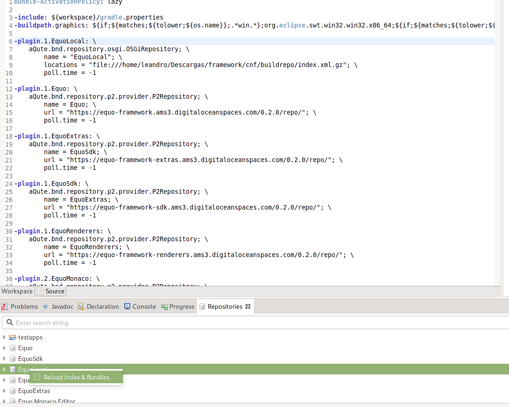

## Developing an Equo application and the Equo SDK in parallel

As it's useful to have a sample application to develop the Equo SDK, we are developing simple apps like the ones in [testapps](https://github.com/equoplatform/testapps) project, the [Netflix application](https://github.com/equoplatform/netflix-app) or the [PoC](https://github.com/equoplatform/poc). This apps are Equo applications which allows us to develop against the Equo SDK, to use its features, to test it, to show how the Equo SDK works, and to innovate in ways we don't think before.

To develop this apps and continue developing the Equo SDK in parallel, follow the next steps:

1. Clone the apps repository: https://github.com/equoplatform/testapps or https://github.com/equoplatform/netflix-app or https://github.com/equoplatform/poc.

2. Open another Eclipse instance, besides the one opened with the SDK. Then, you will have two instances of the same Eclipse for both the Equo SDK and the Equo app, but they will run in different workspaces.

3. After you opened a new Eclipse instance, create a new workspace for the app (i.e. testapps-ws).

4. Import the application projects from the location you cloned it. If you see errors on your projects, go to Projects -> clean, and clean all.

**Note**: If you do not want to use your own version of the SDK, jump to step 8.

5. This apps run by default with the released version of the SDK, consumed online from Equo repositories. To **use a local version of the SDK** (the one you are working on) you need to **make two changes**:

    - Open the `cnf/build.bnd` file and add a **local OSGi repository with an URL pointing to your local SDK build repository** (`cnf/release/index.xml.gz` index file inside the SDK). The modified file will be something like this, with the first plugin being the new one we just added:

      ```
      -include: https://dl.equo.dev/core/1.0/equobuild.bnd

      -plugin.1.EquoLocal: \
        aQute.bnd.repository.osgi.OSGiRepository; \
          name = "EquoLocal"; \
          locations = "file:///home/username/Equo/core/cnf/release/index.xml.gz"; \
          poll.time = -1
      ```

      You can add more local repositories for each component of the SDK that you are developing ([Filesystem](https://github.com/equoplatform/filesystem), [Renderers](https://github.com/equoplatform/renderers))

    - Open the `<app_to_run_bundle>/bnd.bnd` file, select `source` in the editor tool bar and modify the first `-include` sentence so that it points to the `equoapp.bnd` file of your local Equo SDK (or to your local renderers/filesystem bnd file) instead of consuming it online. After your change, it should look like this:

      ```
      -include: /home/username/Equo/core/cnf/equoapp.bnd
      ```

6. Rebuild the entire workspace: Project -> clean -> clean all.

7. When you make changes in your local SDK and it's rebuilded (Generally automatically by the IDE) you have to reload the repository in the testapp workspace.

   Open the repositories View (Window -> Show View -> Other... and seek for Repositories view in BndTools group). You will see all the repositories present in the build.bnd file. Right click to EquoLocal repository (or the name of your local one) and click on "Reload Index & Bundles":



8. To run the application go to the **<app_to_run>** bundle, open the _bnd.bnd_ file, then go to the _Run_ tab, and then click on the _Run OSGI_ button. If you see errors about bundle checksums, you may need to do step 7 again.

**Note**: In Ubuntu versions 18.04 or higher, you may run into this error trying to run the app:
```
java.lang.UnsatisfiedLinkError: libgconf-2.so.4: cannot open shared object file: No such file or directory
```
fix it by installing libconf-2.so.4:
```
apt install libgconf2-4
```

Now you can start coding both the Equo SDK and the Equo application in parallel. When you perform code changes in the Equo SDK and want it to be reflected on your application, you have to repeat the step 7.

Happy coding!

## Develop the SDK in parallel with a standalone app

The configs for a standalone app are similar. In this scenario, the local repository is configured by system properties.

There are two configurations to make. The same at the step 5 explained before for bnd apps:

* Set a local repository
* Set the local `equoapp.bnd` file

The local repository is set with the property `develop.repos`. The value is a list of URIs for repositories to add, separated by ';'.

The `equoapp.bnd` file is set with the property `develop.bnds`. Its value is a list of paths to bnd files to include, separated by ';'.

So all you need to do to run a standalone app with your local SDK is to set properties like the follow ones into the VM args and run it:

```
-Ddevelop.bnds="/home/username/Equo/core/cnf/equoapp.bnd"
-Ddevelop.repos="file:///home/username/Equo/core/cnf/release/index.xml.gz"
```

## Troubleshooting

* If you find any compilation or build problem after you get changes from the remote repository try to clean the workspace. If not, apply the following actions:

  1. Open the Repositories view of Bnd.
  2. **Refresh** the repositories that are involved (i.e. ChromiumSWT and EquoLocal). if you are unsure refresh all off them.
  3. Reload the file cnf/build.bnd.
  4. Project -> clean to all projects.
