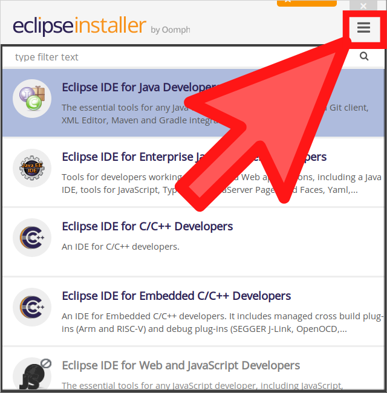
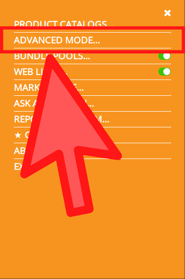
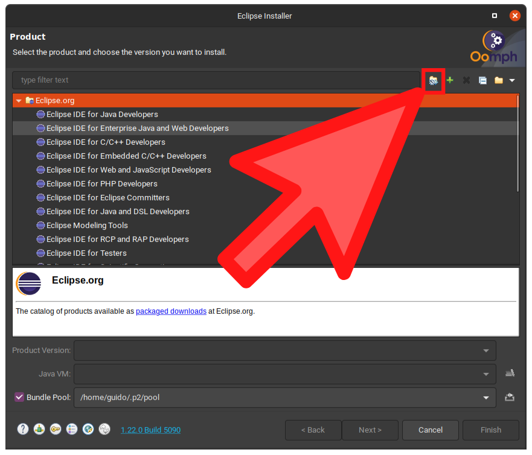
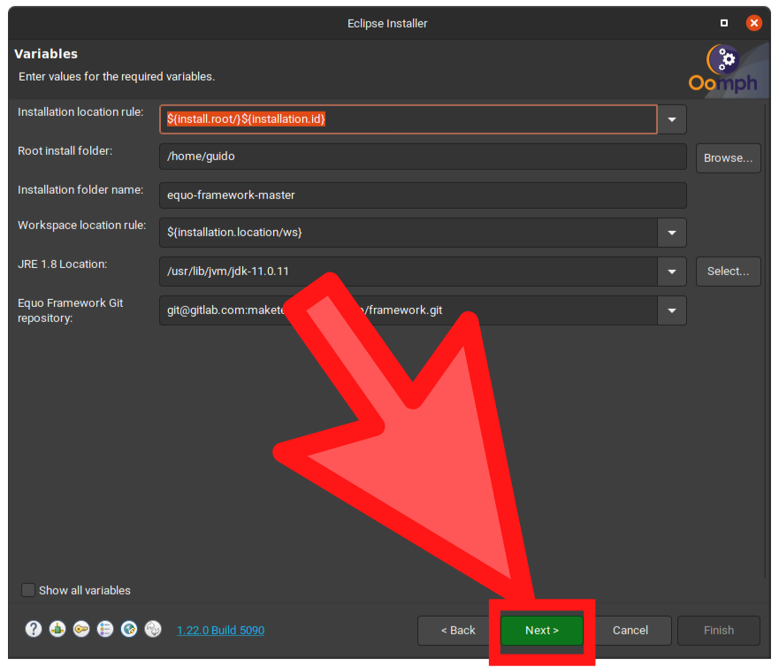
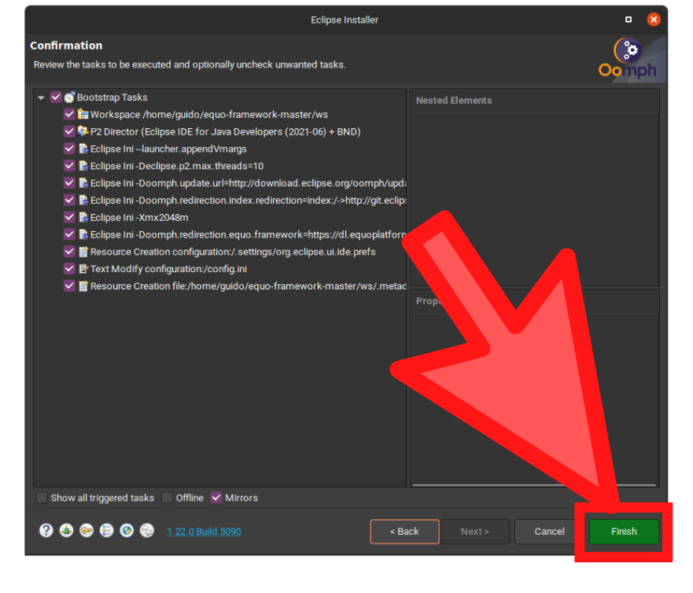
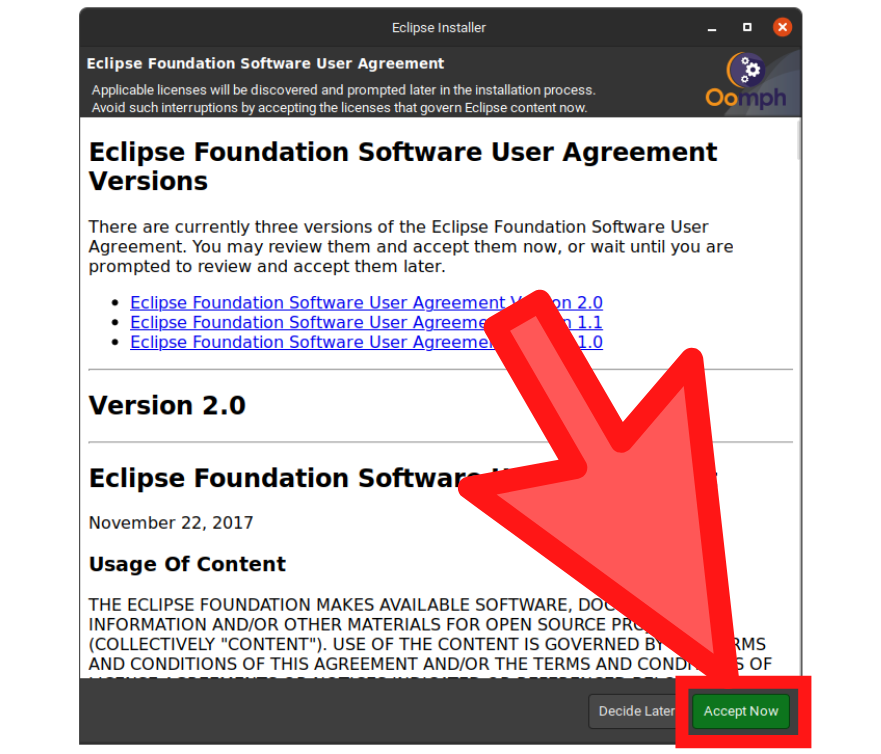
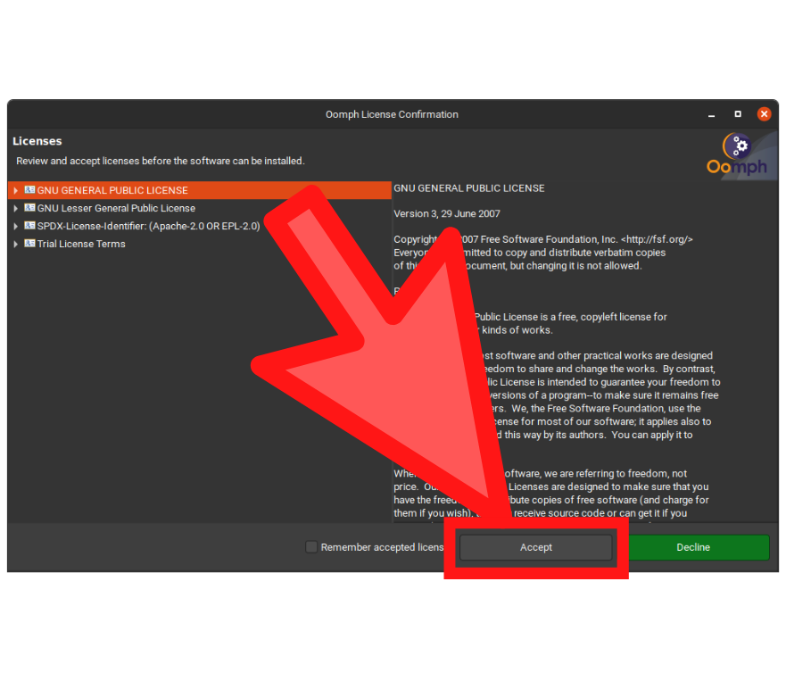
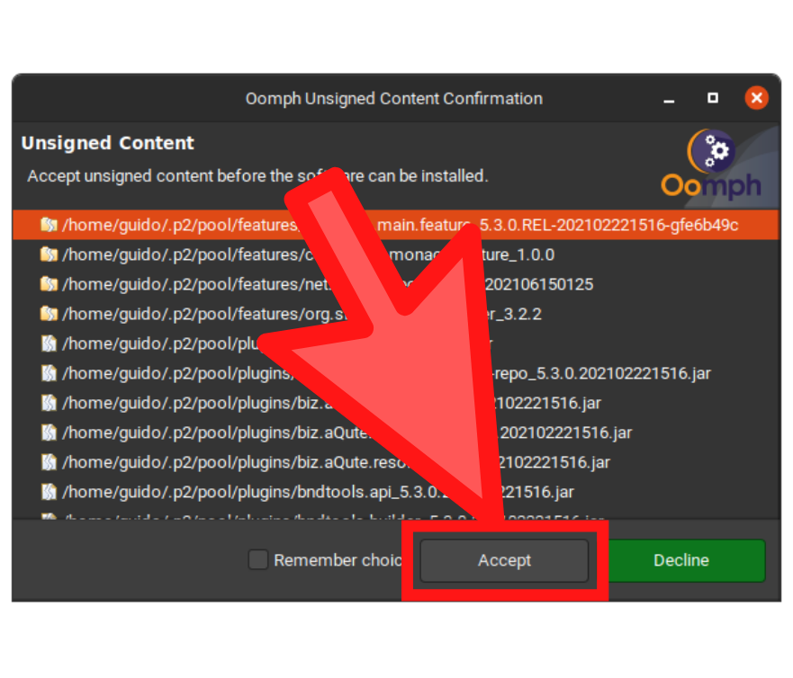
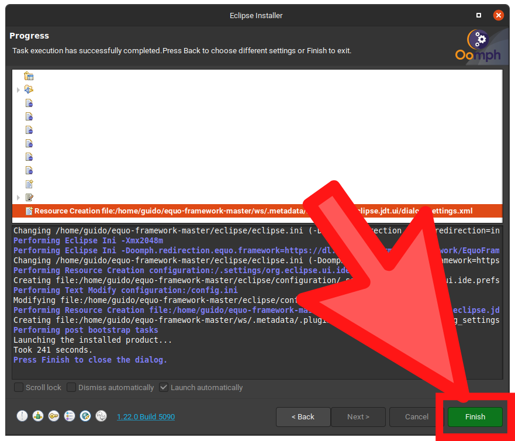

# Equo SDK

## Development Environment

1. Download [<u>_Eclipse Installer_</u>][ECLIPSE] and run it (Click _advanced mode_ button):

   

2. Open the installer you just downloaded and switch to advance mode

   

3. Copy the **content** of the file _EquoSDKConfig.setup_ located in _cnf_ folder of this project.

   ```bash
      # Linux & Mac
      cat core/cnf/EquoSDKConfig.setup
   ```

   ```powershell
      # Windows
      type core\cnf\EquoSDKConfig.setup
   ```

4. Go back to the Eclipse Installer, you will see a button in the toolbar which allows to paste the configuration you just copied to the clipboard. That's the _EquoSDKConfig.setup_ configuration. Click that button.

   

5. Click **Next** and then **Finish** to proceed with the installation.

   
   
   
   
   
   

## Workspace configurations

Once you open a new workspace in Eclipse (the IDE installed before), there are a few settings needed to work well with the SDK:

1. Configure compilance compatibility to generate _.class_ files for Java 1.8 (`Window ⟶ Preferences ⟶ Java ⟶ Compiler`).

   
   
   
   

   But if you want set `Compiler compilance level` in 11, for example, so disable the checkboxes `Use '--release' option` and `Use default compilance settings`.

   Then, you should set to 1.8 the fields `Generated .class files compatibility` and `Source compatibility`.
   <br/>

   

   Press `Apply`.

   

2. Import the _checkstyle_ file to check Equo code styling as you are developing. For this, you need to:
   1. Go to `Window ⟶ Preferences ⟶ Checkstyle`.

      
      
      

   2. Select `New...` in the _Global Check Configurations_ section.

   3. Change the type of the new configuration to `External Configuration File`:

      

      - Write "Equo" on the name field.
      - Import from this project the file located in `config/checkstyle/checkstyle.xml` in the _location_ field.
   4. Press `Ok`
   5. Select the recently created configuration and press the `Set as Default` button.

      

   6. Check `Run Checkstyle in background on full builds` option.

      

   7. Press `Apply and Close`
   8. If a dialog box appears, saying _rebuild suggested_, press `Yes`

      

3. Import Equo formatter for Eclipse:
   1. Go to `Window ⟶ Preferences ⟶ Java ⟶ Code Style ⟶ Formatter`.

      
      
      
      
      

   2. Press `Import...` and select the file of this project located in `config/eclipse/Equo formatter.xml`.
   3. Press `Apply and close`

      

### Visual Studio Code

   If you want work with typescript or javascript files into SDK, only few extensions are needed:

   1. [Error Lens][ERROR_LENS]
   2. [ESLint][ESLINT]
   3. [EditorConfig for VS Code][EDITOR_CONFIG]

  And a few settings in your local settings of vscode are nedeed:

  ```json
  {
    "errorLens.fontSize": "12",
    "errorLens.fontWeight": "bold",
    "errorLens.severityText": [
      "ERROR",
      "WARNING",
      "INFO",
      "HINT"
    ],
    "errorLens.messageTemplate": "[$severity] $message",
    "[json]": {
      "editor.defaultFormatter": "dbaeumer.vscode-eslint"
    },
    "[javascript]": {
      "editor.defaultFormatter": "dbaeumer.vscode-eslint"
    },
    "[typescript]": {
      "editor.defaultFormatter": "dbaeumer.vscode-eslint"
    },
    "[vue]": {
      "editor.defaultFormatter": "dbaeumer.vscode-eslint"
    },
    "[html]": {
      "editor.defaultFormatter": "dbaeumer.vscode-eslint"
    },
    "eslint.format.enable": true,
    "eslint.validate": [
      "javascript",
      "typescript",
      "vue",
      "json",
      "html"
    ],
    "eslint.options": {
      "extensions": [
          ".ts",
          ".js",
          ".vue"
          ".json",
          ".html"
      ]
    },
  }
  ```

<!-- links [CASE_CONSTANT]: https://link -->
   [ECLIPSE]: https://wiki.eclipse.org/Eclipse_Installer
   [ERROR_LENS]: https://marketplace.visualstudio.com/items?itemName=usernamehw.errorlens
   [ESLINT]: https://marketplace.visualstudio.com/items?itemName=dbaeumer.vscode-eslint
   [EDITOR_CONFIG]: https://marketplace.visualstudio.com/items?itemName=EditorConfig.EditorConfig
